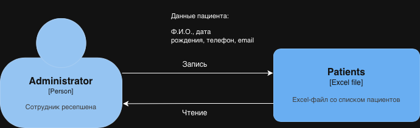
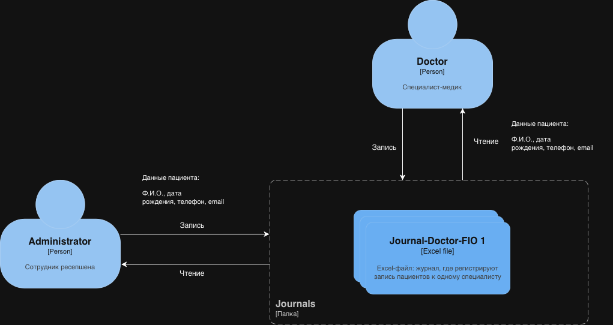
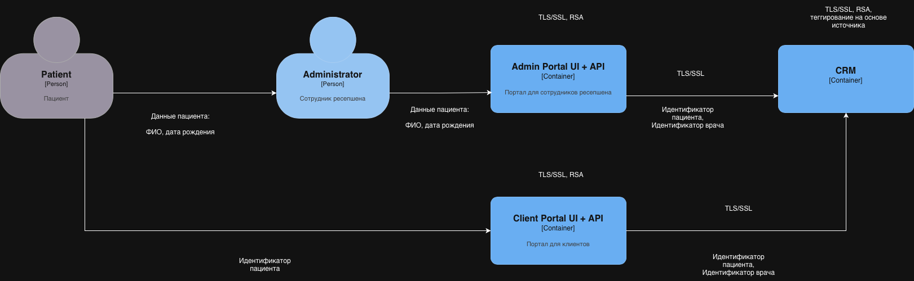
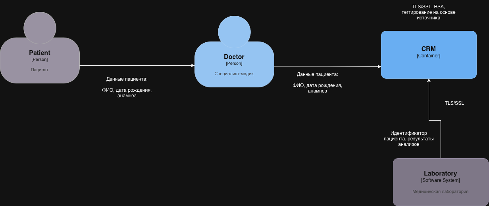

# Task 1

## Процессы (RAW):

1. Регистрация пациента

### Список проблемных зон:
- Данные хранятся в локальных файлах (Excel, JPG, PDF) на общем диске
- Не реализованы меры по шифрованию и защищенному хранению конфиденциальной информации
- Работа с персональными данными не отвечает требованиям российского законодательства

### AS-IS

### TO-BE

2. Запись пациента на прием

### Список проблемных зон:
- Отсутствие разграничения доступа к данным пациентов
- Неограниченный доступ к медицинской информации
- Нет аудита действий сотрудников при работе с конфиденциальными данными

### AS-IS

### TO-BE

3. Обработка медицинских анализов

### Список проблемных зон:
- Отсутствие системы алертинга о несанкционированном доступе или нетипичных действиях
- Передача данных между системами не контролируется и не защищена
- Процесс обработки данных полностью ручной

### AS-IS

### TO-BE

## Решения:

|Тип данных|Способы|
|---|---|
|Персональные данные|Шифрование, Обфускация|
|Финансовая информация|Шифрование, Обезличивание|
|Медицинские данные|Шифрование, Обезличивание|
|Информация о сотрудниках|Обезличивание|

В качестве механизма теггирования данных стоит использовать RBAC, на основе ролей будет реализована система контроля доступа к данным. Для этого будет использовать платформа OneTrust, так как поддержка и внедрение менее затратны.

### Список инструментов, мер и способов для обеспечения конфиденциальности данных

- Применение шифрование на всех этапах передачи и хранения данных (AES, RSA)
- Обфускация ПД пациентов для отправки во внешние системы (например, лаборатория)
- Проведение регулярного аудита контроль доступа
- Разработка алгоритмов удаления учетных записей при увольнении
- Использование технологий мониторинга и алертинга для отслеживания аномалий
- Применение протоколов безопасности при использовании сети (HTTPS, FTPS, TLS, SSL)
- Применение контроля доступа к данным и системам (Active Directory, Keycloak)
