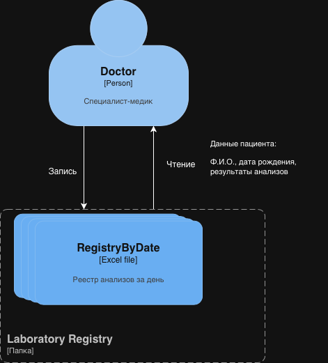

# Task 1

## Процессы (RAW):

1. Регистрация пациента

2. Запись пациента на прием

3. Обработка медицинских анализов

## Список проблемных зон:

- Хранение критически важных данных в Excel.
- Отсутствие контроля доступа к конфиденциальной информации.
- Отсутствие мониторинга доступа к данным.

## Решения:

|Тип данных|Способы|
|---|---|
|Персональные данные|Шифрование, Обфускация|
|Финансовая информация|Шифрование, Обезличивание|
|Медицинские данные|Шифрование, Обезличивание|
|Информация о сотрудниках|Обезличивание|

В качестве механизма теггирования данных стоит использовать RBAC, на основе ролей будет реализована система контроля доступа к данным. Для этого будет использовать платформа OneTrust, так как поддержка и внедрение менее затратны.

### Список инструментов, мер и способов для обеспечения конфиденциальности данных

- Применение шифрование на всех этапах передачи и хранения данных (AES, RSA)
- Обфускация ПД пациентов для отправки во внешние системы (например, лаборатория)
- Проведение регулярного аудита контроль доступа
- Разработка алгоритмов удаления учетных записей при увольнении
- Использование технологий мониторинга и алертинга для отслеживания аномалий
- Применение протоколов безопасности при использовании сети (HTTPS, FTPS, TLS, SSL)
- Применение контроля доступа к данным и системам (Active Directory, Keycloak)
