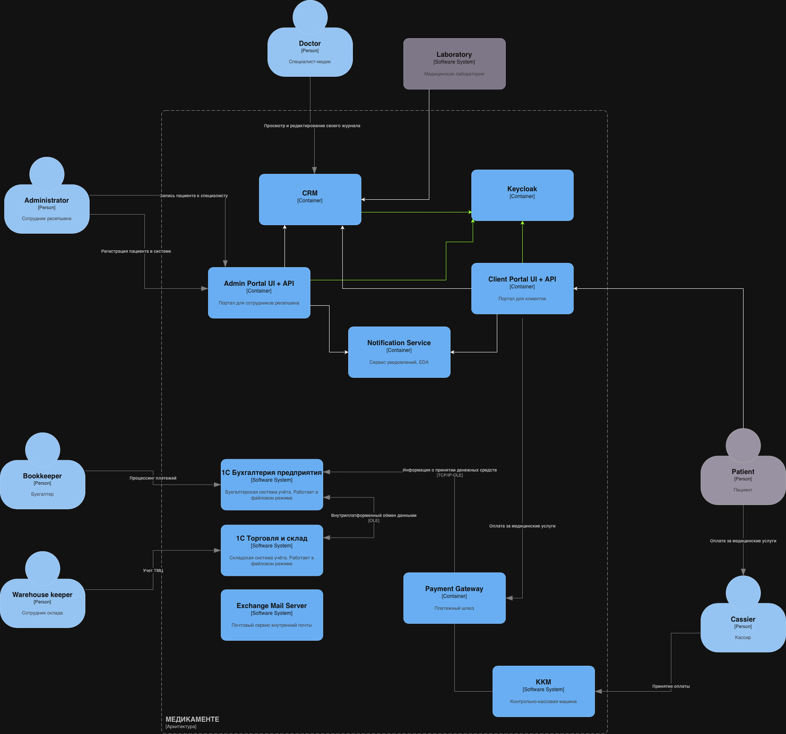
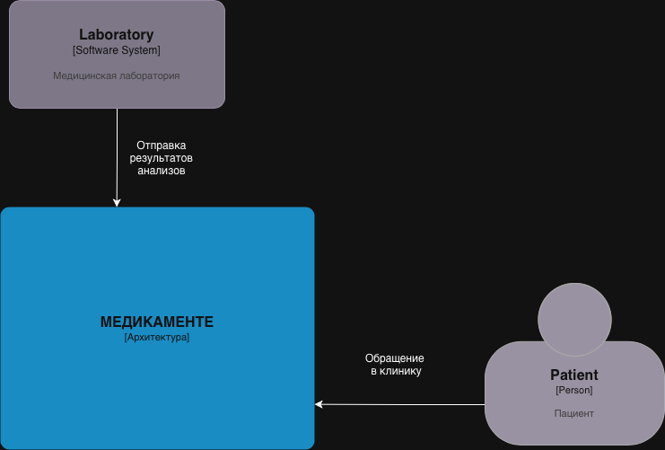

# Task 2

Используем EDA. 

Регистрация:

Для регистрации пользователей теперь доступен клиентский портал. После создания пользователя, отрабатывает событие `UserCreatedEvent`, по этому событию создается карточка пациента в CRM и портале администраторов. При регистрации указываются минимально необходимый набор данных: 

- Полное имя
- Дата рождения
- Адрес электронной почты
- Номер телефона

Если пациента регистрируют администраторы, то сначала появляется карточка пациента у них на портале, отрабатывает событие `UserRegisteredEvent` и у пациента появляется доступ к личному кабинету через клиентский портал. 

Запись существующего клиента:

Для записи к специалисту теперь доступен клиентский портал. После создания записи срабатывает событие `RecordCreatedEvent`. По событию запись появляется в в CRM и портале администраторов, также создается задача в сервисе уведомлений, на рассылку врачу и пациенту.

CRM будет взаимодействовать с API (HTTPS) внешней лаборатории для получения результатов. Для взаимодействия также будет использование обезличивание данных, так как API уже реализовано и нет возможности использовать Zero Trust Architecture.

Для аутентификации администраторов системы будет использоваться Keycloak + ActiveDirectory, а для клиентов Keycloak + OAuth 2.0. Разделение доступов на основе RBAC.

Для аналитики необходимо согласие пользователя. Его можно загрузить через портал администратора или клиентский портал. После получения согласия, CRM будет автоматически собирать данные в аналитическую БД для последующего анализа с помощью BI-, AI- инструментов. Для наиболее эффективного отчета будет внедрен подход Data Lineage.

## Диаграмма контейнеров

## Диаграмма контекста

## CRM

1. Модуль аналитики данных
   - Функции: Обработка, анализ и визуализация данных для извлечения аналитической информации.
   - Механизмы защиты:
     - Использование анонимизации и обфускации данных для защиты приватности во время анализа.
     - Секретные ключи для идентификации пользователей без прямого доступа к их личным данным.

2. Управление согласиями
   - Функции: Обеспечение получения согласий на обработку данных от пользователей.
   - Механизмы защиты:
     - Хранение согласий в защищенном виде.
     - Автоматическая блокировка работы с данными, если согласие отсутствует или недействительно.

3. Аудит и мониторинг
   - Функции: Отслеживание всех операций, связанных с аналитикой данных.
   - Механизмы защиты:
     - Логирование доступа и действий с данными, включая временные метки и идентификацию пользователей.
     - Регулярные отчеты о доступе к данным для внутреннего и внешнего аудита.

## Keycloak

Контроль доступа
   - Функции: Обеспечение защиты данных от несанкционированного доступа.
   - Механизмы защиты:
     - Применение ролей и политик на основе тегирования данных, ограничивающее доступ к аналитическим данным в зависимости от уровня доступа.
