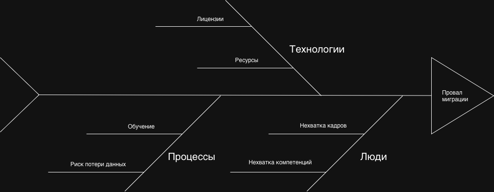

# Task 4

|Категория|Риск|Описание|Приоритет|Рекомендации|
|---|---|---|---|---|
|Люди|Нехватка кадров|Для такой масштабной миграции и разработке новых сервисов в команде IT-отдела нет достаточного количества специалистов|Высокий|Либо открывать новые вакансии, либо аутсорсить|
|Люди|Нехватка компетенций|Возможно, текущая команда IT-отдела не обладает компетенциями для нового технологического стека, поэтому будет проектировать новую систему исходя из имеющихся знаний, в результате чего могут упустить потенциально эффективные решения|Высокий|Либо обучение, либо аусторсить|
|Технологии|Лицензии|Выбранные инструменты могут иметь высокую стоимость|Средний|Ориентироваться, в основном, на open-source решения|
|Технологии|Ресурсы|Для выбранной архитектуры необходимы серверные ресурсы|Низкий|Проектировать распределенные высокоэффективные решения|
|Процессы|Потеря данных|Так как текущие процессы имеют недостаток документации, выстраивание новых может не учесть некоторые данные|Высокий|Запускать новые решения параллельно со старыми. Например, пока в старой системе у специалиста существуют приемы, он ведет их там  Новые создает в новой. Постепенный переход поможет избежать казусов|
|Процессы|Обучение|Персонал необходимо обучать работе в новых системах|Низкий|Рекомендуется проводить интерактивное обучение по шагам для визуализации процессов|